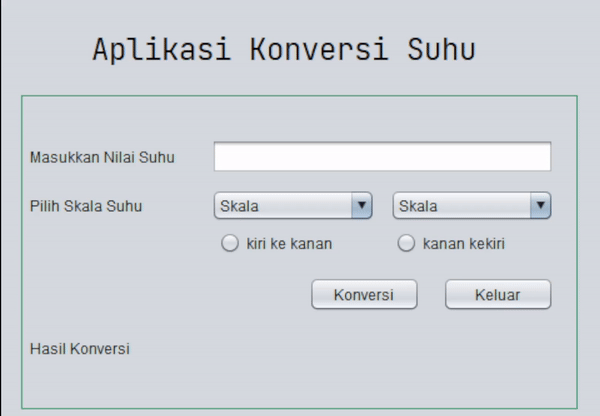

# Aplikasi Konversi Suhu

*Aplikasi Konversi Suhu* adalah program berbasis Java Swing yang memudahkan pengguna untuk mengonversi suhu dari satu skala ke skala lainnya. Aplikasi ini dilengkapi dengan antarmuka pengguna yang intuitif dan fitur validasi input untuk pengalaman pengguna yang lebih baik.

## Fitur Utama

- **Input Angka Validasi**: Pengguna hanya bisa memasukkan angka atau titik desimal. Input non-numerik akan diblokir secara otomatis.
- **Pilihan Skala Suhu**: Aplikasi mendukung konversi antara skala suhu berikut:
  - Celcius
  - Fahrenheit
  - Kelvin
  - Reamur
- **Arah Konversi**: Pengguna dapat memilih arah konversi menggunakan tombol radio:
  - Dari kiri ke kanan (skala kiri ke skala kanan)
  - Dari kanan ke kiri (skala kanan ke skala kiri)
- **Otomatis Mengonversi**: Nilai suhu yang dimasukkan akan dikonversi secara otomatis saat ada perubahan pada input.
- **Tombol Keluar**: Tombol untuk menutup aplikasi dengan cepat.

## Cara Menggunakan Aplikasi

1. Masukkan nilai suhu di kolom yang disediakan.
2. Pilih skala suhu awal dan skala tujuan dari daftar dropdown.
3. Tentukan arah konversi menggunakan tombol radio:
   - **Kiri ke kanan**: Konversi dari skala di dropdown kiri ke skala di dropdown kanan.
   - **Kanan ke kiri**: Konversi dari skala di dropdown kanan ke skala di dropdown kiri.
4. Klik tombol **Konversi** untuk melihat hasilnya.
5. Tekan tombol **Keluar** untuk menutup aplikasi.

## Prasyarat

- Java Development Kit (JDK) 8 atau versi yang lebih baru.
- IDE seperti NetBeans atau IntelliJ untuk menjalankan dan mengedit kode.

## Struktur Kode

- **KonversSuhuFrame.java**: Kelas utama yang menangani antarmuka pengguna dan logika aplikasi.
- **KonversiSuhuHelper.java**: Kelas pembantu untuk perhitungan konversi suhu.

## Instalasi

1. Klon atau unduh repositori ini.
2. Buka proyek di IDE favorit Anda.
3. Jalankan file `KonversSuhuFrame.java` untuk memulai aplikasi.

# Demo

# Pembuat Aplikasi
 Muhammad Akmal ( 2210010437 ) 
